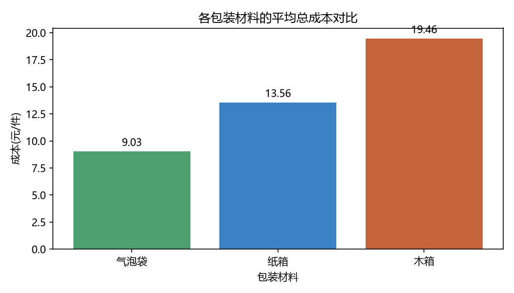
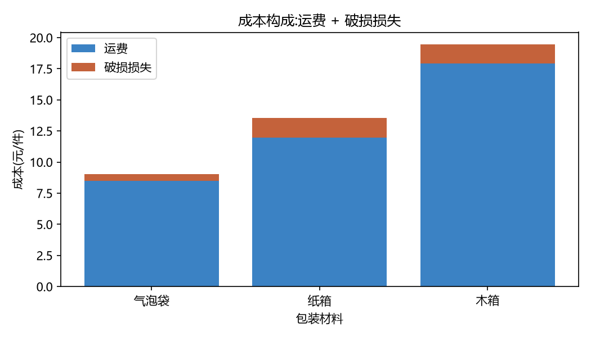
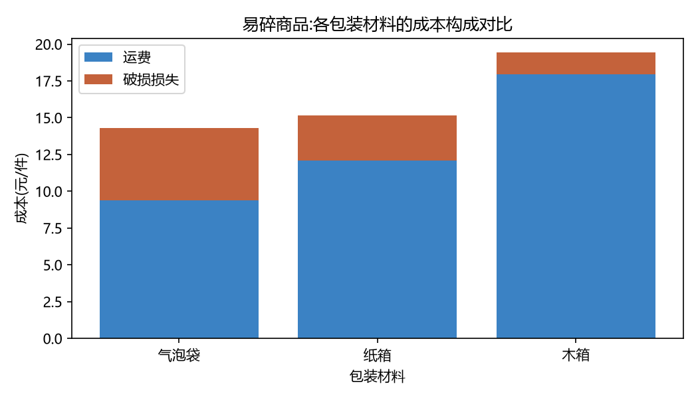
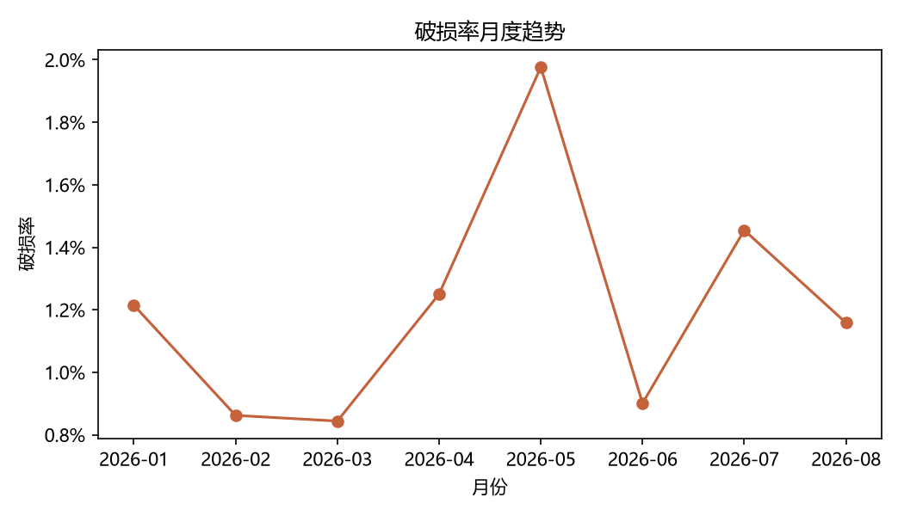

# 包装成本分析:不同包装材料的综合成本对比

用 Python(pandas + matplotlib)分析 1969 条快递包裹记录,比较纸箱、木箱、气泡袋三种包装材料的**综合成本**(运费 + 破损损失),并给出可执行的优化建议。

## 项目背景

电商物流中,包装材料的选择直接影响两笔成本:**运费**(与重量、体积相关)和**破损赔偿**。只看运费做决策容易失误,本项目把两者合并为"总成本"统一比较。

## 数据说明

项目包含三层数据,完整还原"生成 → 清洗 → 分析"的真实流程:

| 文件 | 说明 |
| --- | --- |
| `data/packages_raw.csv` | 2030 行原始数据,由 `generate_data.py` 生成,故意注入了常见脏数据 |
| `data/packages_clean.csv` | 1969 行清洗后数据,由 `clean_data.py` 生成,供分析使用 |

原始数据的字段:

| 字段 | 含义 |
| --- | --- |
| order_id | 订单编号 |
| order_date | 下单日期(2026-01 ~ 2026-08) |
| city | 收货城市(8 个城市) |
| category | 商品类别(electronics / glass / ceramics / clothing / books) |
| fragile | 是否易碎(1 = 是) |
| weight_kg / length_cm / width_cm / height_cm | 重量与尺寸 |
| material | 包装材料(cardboard / wood / bubble) |
| freight_cost | 运费(元) |
| value | 商品货值(元) |
| damaged | 是否破损(1 = 破损) |

### 注入的脏数据

`generate_data.py` 使用固定随机种子(seed=42),保证结果可复现,并注入以下问题:

- **重复行**:约 1.5% 的订单被重复记录
- **缺失值**:重量、尺寸、货值、破损状态均有缺失
- **异常值**:重量出现 999 kg 的录入错误
- **单位错误**:约 1% 的"克"被当成"千克"录入(数值放大 1000 倍)
- **城市写法不统一**:如 `北京市`、` 上海`、`SHANGHAI`、`SHENZHEN`

## 数据清洗

`clean_data.py` 执行以下步骤,并打印清洗前后的数据质量报告:

1. 删除完全重复的行
2. 统一城市写法(去空格 + 别名映射)
3. 修正单位错误:重量 > 100 视为"克",除以 1000
4. 剔除不合理重量(≤0 或 >50kg)
5. 数值缺失用**同类别中位数**填补(避免被异常值带偏)
6. 删除破损状态缺失、无法分析的记录
7. 再次去重(中位数填补可能让原本不同的行变得相同)
8. 派生 `volume`、`unit_freight`、`month` 等分析字段

清洗效果:**2030 行 → 1969 行,缺失值与异常重量全部处理完毕,重量最大值从 4790 修正到 4.99**。

## 分析方法

核心公式:

```
总成本 = 平均运费 + 破损率 × 平均货值
```

其中"破损率 × 货值"是每件商品分摊到的预期破损损失。分析分为三层:**整体对比 → 易碎品分层 → 破损率月度趋势**。

## 核心发现

### 1. 整体对比(全部商品)

| 包装材料 | 平均运费 | 破损率 | 破损损失 | 总成本 |
| --- | --- | --- | --- | --- |
| bubble(气泡袋) | 8.50 | 1.2% | 0.53 | 9.03 |
| cardboard(纸箱) | 11.95 | 2.0% | 1.61 | 13.56 |
| wood(木箱) | 17.92 | 0.8% | 1.53 | 19.45 |

### 2. 易碎商品分层(857 单)

| 包装材料 | 平均运费 | 破损率 | 破损损失 | 总成本 |
| --- | --- | --- | --- | --- |
| bubble(气泡袋) | 9.36 | 4.0% | 4.94 | **14.31** |
| cardboard(纸箱) | 12.09 | 2.1% | 3.04 | 15.13 |
| wood(木箱) | 17.94 | 1.1% | 1.49 | **19.42** |

3. 木箱的防护效果最好(破损率仅 1.1%),但运费比气泡袋高 **8.6 元/件**,远超它省下的破损损失(3.45 元),因此在"总成本"口径下反而最贵。
4. 破损率月度波动区间为 0.84% ~ 1.98%,存在明显的月份差异。

### 图表









## 结论与建议

1. 在只考虑运费与赔偿的前提下,易碎品使用气泡袋的总成本最低(14.31 元/件),比木箱低 5.12 元/件。
2. 但气泡袋的破损率为 4%,是木箱的 3.6 倍——**破损率本身会影响客户体验和退货成本,这些成本不在数据中**,所以不能只按总成本下结论。
3. 建议分两步:先对高价值易碎品保留木箱;对中低价值易碎品做"气泡袋 + 加强缓冲"的小批量试运,跟踪破损率与客诉率后再决定是否切换。
4. 破损率月度波动明显,建议进一步按城市、线路拆分,定位高破损环节。

## 局限说明

数据为模拟生成(破损率接近真实快递水平 1%-3%),旨在演示分析框架与决策方法;真实场景还需纳入退货成本、客诉率、材料采购价等指标。

## 如何运行

```bash
pip install -r requirements.txt
python generate_data.py    # 生成 2030 行含脏数据的原始数据
python clean_data.py       # 清洗并输出数据质量报告
python analysis.py         # 输出分析结果与图表
```

## 用到的技能

- Python 基础:函数、循环、条件判断、字典、异常处理
- pandas:读取/写入 CSV、派生列、筛选、`groupby` 分组统计、缺失值处理、数据合并
- 数据清洗:重复值、缺失值、异常值、单位不一致、类别名称标准化
- matplotlib:柱状图、堆叠柱状图、折线图、中文显示配置
- 分析方法:指标设计、分层分析、成本测算、决策阈值
